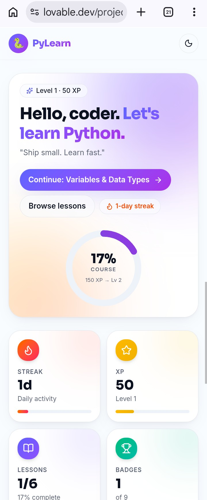
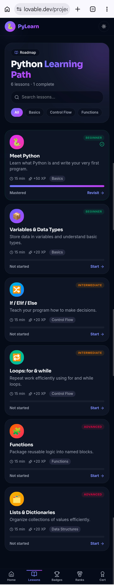
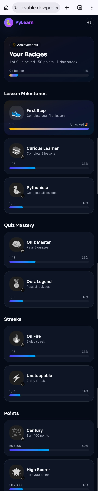

# 🐍 PyStar — Learn Python the Modern Way

[](LICENSE) [](https://pystar.lovable.app)

> An interactive Python learning platform with lessons, quizzes, badges, streaks, a leaderboard, and a certificate of completion.

🌐 **Live App:** [pystar.lovable.app](https://pystar.lovable.app)

---

## ✨ Features

- 📚 **6 Structured Lessons** — Beginner to Advanced (Basics, Control Flow, Functions, Data Structures)
- 🧠 **Quizzes** — Test your knowledge after every lesson
- 🏅 **9 Badges** — Earn badges for milestones (First Step, Pythonista, Quiz Legend, and more)
- 🔥 **Streak Tracking** — Daily activity streaks to keep you consistent
- 🏆 **Leaderboard** — Compete with other learners and climb the ranks
- 🎓 **Certificate of Completion** — Downloadable certificate after finishing all lessons and quizzes
- 📱 **Mobile-First Design** — Fully responsive, built for phones

---

## 🛠️ Tech Stack

- **Frontend:** React + TypeScript
- **Styling:** Tailwind CSS
- **Animations:** Framer Motion
- **Build Tool:** Vite
- **Hosting:** Lovable (pystar.lovable.app)
- **Version Control:** GitHub

---

## 🚀 Getting Started

```bash
# Clone the repo
git clone https://github.com/05unique-dotcom/pystar.git

# Install dependencies
cd pystar
npm install

# Run locally
npm run dev
```

> Note: Recommended Node.js version: 18+

---

## 📖 Lessons Covered

1. **Meet Python** — Intro to Python, your first program
2. **Variables & Data Types** — Storing and using data
3. **If / Elif / Else** — Making decisions in code
4. **Loops: for & while** — Repeating tasks efficiently
5. **Functions** — Reusable blocks of logic
6. **Lists & Dictionaries** — Working with collections

---

## 📸 Screenshots

| Home | Lessons | Badges |
|------|---------|--------|
| 



 | 



 | 

 

 
---

## ✅ Checklist (before sharing)

- [ ] Add real screenshots to `docs/assets/` or `public/screenshots/`
- [ ] Add `.env.example` if the app requires environment variables
- [ ] Add `.gitignore` to ignore `node_modules`, `dist`, and local env files
- [ ] Add tests and CI (optional)

---

## 👨‍💻 Author

**Arshad Ansari (05unique-dotcom)**
- GitHub: [@05unique-dotcom](https://github.com/05unique-dotcom)
- Live app: [pystar.lovable.app](https://pystar.lovable.app)

---

## 📄 License

This project is open source and available under the [MIT License](LICENSE).

---

If you want, I can also add screenshots and CI badges, or create CONTRIBUTING.md and CODE_OF_CONDUCT files.